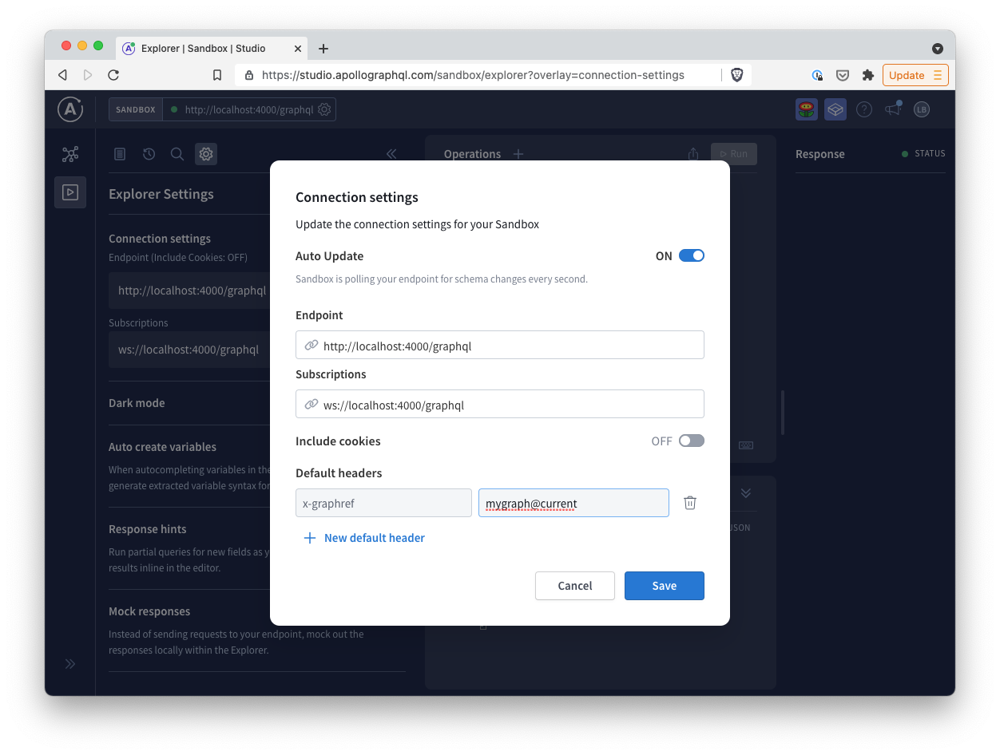

# Multiple Apollo Gateways in a Single Express Server

A demonstration of running multiple instances of Apollo Server and Apollo Gateway within a single Express server. Uses Managed Federation and determines the `graphRef` from HTTP request headers.

**The code in this repository is experimental and has been provided for reference purposes only. Community feedback is welcome but this project may not be supported in the same way that repositories in the official [Apollo GraphQL GitHub organization](https://github.com/apollographql) are. If you need help you can file an issue on this repository, [contact Apollo](https://www.apollographql.com/contact-sales) to talk to an expert, or create a ticket directly in Apollo Studio.**

## Installation

```sh
git clone git@github.com:apollosolutions/multiple-gateways-in-express.git
cd multiple-gateways-in-express
yarn
```

## Usage

```sh
export APOLLO_KEY=<your apollo api key for all graphrefs>
yarn start
```

Open [`http://localhost:4000`](http://localhost:4000). It will redirect you to Apollo Sandbox. From there you can specify the `graphRef` by setting a default header in the Connection settings:



## Known Limitations

- Assumes that all `graphRef`s are accessible via the same API key. You could choose to pass separate API keys in the Apollo Server constructor:
  ```js
  const server = new ApolloServer({
    gateway,
    apollo: {
      graphRef: graphRef,
      key: someOtherAPIKey,
    },
  });
  ```
- Will allow creating any number of instances given enough valid `graphRefs` and they live for the duration of the Node.js process. It's probably a good idea to cap the number of running instances to avoid using too much memory.
